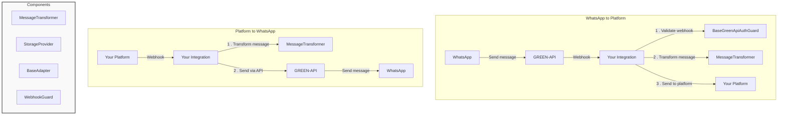

# Universal Integration Platform for GREEN-API

## Support links

[](mailto:support@greenapi.com)
[](https://t.me/greenapi_support_eng_bot)
[](https://wa.me/77273122366)

## Guides & News

[](https://www.youtube.com/@greenapi-en)
[](https://t.me/green_api)
[](https://whatsapp.com/channel/0029VaLj6J4LNSa2B5Jx6s3h)

- [Документация на русском языке](./README.ru.md)

A flexible integration platform designed to simplify the process of connecting GREEN-API's WhatsApp gateway with various
third-party services.

## Table of Contents

- [Installation](#installation)
- [Core Components](#core-components)
- [Developer Guide](#developer-guide)
- [Working Example](#working-example)
- [Real-World Examples](#real-world-examples)
- [Best Practices](#best-practices)

## Installation

```bash
npm install @green-api/greenapi-integration
```

## Core Components

### 1. BaseAdapter

The foundation of your integration. Handles message & instance management, and platform-specific logic.

```typescript
abstract class BaseAdapter<TPlatformWebhook, TPlatformMessage> {
	public constructor(
		transformer: MessageTransformer<TPlatformWebhook, TPlatformMessage>,
		storage: StorageProvider
	);

	public abstract createPlatformClient(params: any): Promise<any>;

	public abstract sendToPlatform(message: TPlatformMessage, instance: TInstance): Promise<void>;
}
```

#### Methods

When extending BaseAdapter, your implementation has access to several methods:

##### Webhook Handling

These webhook handling methods call your message transformation methods automatically, without the need to use them
directly in
your code.

```typescript
// Handle webhooks from your platform
await adapter.handlePlatformWebhook(webhookData, instanceId);

// Handle webhooks from GREEN-API. The second parameter is telling the function to handle only specific webhooks.
// The second parameter must be specified, otherwise webhooks will not be processed.
await adapter.handleGreenApiWebhook(webhook, ['incomingMessageReceived']);
```

##### Instance Management

```typescript
// Create new instance
const instance = await adapter.createInstance(instanceData, settings, userEmail);

// Get instance details
const details = await adapter.getInstance(instanceId);

// Remove instance
await adapter.removeInstance(instanceId);
```

##### User Management

```typescript
// Create new user
const user = await adapter.createUser(userEmail, userData);

// Update user
await adapter.updateUser(userEmail, updateData);
```

#### Webhook Implementation Example

```typescript
// Platform webhook endpoint
app.post('/webhook/platform', async (req, res) => {
	try {
		await adapter.handlePlatformWebhook(req.body, instanceId);
		res.status(200).send();
	} catch (error) {
		console.error('Failed to handle platform webhook:', error);
		res.status(500).send();
	}
});

// GREEN-API webhook endpoint
app.post('/webhook/green-api', async (req, res) => {
	try {
		// Process specific webhook types
		await adapter.handleGreenApiWebhook(req.body, [
			'incomingMessageReceived',
			'outgoingMessageStatus'
		]);
		res.status(200).send();
	} catch (error) {
		console.error('Failed to handle GREEN-API webhook:', error);
		res.status(500).send();
	}
});
```

### 2. MessageTransformer

Handles message format conversion between GREEN-API and your platform.

```typescript
abstract class MessageTransformer<TPlatformWebhook, TPlatformMessage> {
	abstract toPlatformMessage(webhook: GreenApiWebhook): TPlatformMessage;

	abstract toGreenApiMessage(message: TPlatformWebhook): Message;
}
```

### 3. StorageProvider

Interface for data persistence operations.

```typescript
abstract class StorageProvider<TUser extends BaseUser = BaseUser, TInstance extends BaseInstance = Instance> {
	abstract createInstance(instance: BaseInstance, userId: bigint | number): Promise<TInstance>;

	abstract getInstance(idInstance: number | bigint): Promise<TInstance | null>;

	abstract removeInstance(instanceId: number | bigint): Promise<TInstance>;

	abstract createUser(data: any): Promise<TUser>;

	abstract findUser(identifier: string): Promise<TUser | null>;

	abstract updateUser(identifier: string, data: any): Promise<TUser>;
}
```

### 4. BaseGreenApiAuthGuard

Handles webhook authentication for incoming GREEN-API requests.

```typescript
abstract class BaseGreenApiAuthGuard<T extends BaseRequest = BaseRequest> {
	constructor(protected storage: StorageProvider);

	// Validates incoming webhook requests
	async validateRequest(request: T): Promise<boolean>;
}
```

Example implementation of `BaseGreenApiAuthGuard`:

```typescript
class YourAuthGuard extends BaseGreenApiAuthGuard<YourRequest> {
	constructor(storage: StorageProvider) {
		super(storage);
	}
}

// Using with Express
app.post('/webhook', async (req, res) => {
	const guard = new YourAuthGuard(storage);
	try {
		await guard.validateRequest(req);
		// Process webhook
	} catch (error) {
		if (error instanceof AuthenticationError) {
			res.status(401).json({error: error.message});
			return;
		}
		res.status(500).json({error: 'Internal server error'});
	}
});
```

### 5. GreenApiClient

Direct interface to GREEN-API methods.

```typescript
const client = new GreenApiClient({
	idInstance: 'your_instance_id',
	apiTokenInstance: 'your_token'
});

// Examples:
await client.setProfilePicture(fileBlob);
await client.getAuthorizationCode(phoneNumber);
await client.getQR();
```

## Developer Guide

This guide will walk you through creating your first integration with GREEN-API's WhatsApp gateway.

### Project Structure

```
your-integration/
├── src/
│   ├── core/
│   │   ├── adapter.ts         # Your platform adapter
│   │   ├── transformer.ts     # Message transformer
│   │   ├── storage.ts         # Data storage implementation
│   │   └── router.ts          # Webhook endpoints
│   ├── types/
│   │   └── types.ts           # Platform-specific types
│   └── main.ts               # Main exports
├── package.json
└── tsconfig.json
```



### Implementation Steps

#### Step 1: Define Platform Types

First, define the message types for your platform:

```typescript
// types/types.ts
export interface YourPlatformWebhook {
	id: string;
	from: string;
	message: string;
	timestamp: number;
	// Add other platform-specific fields
}

export interface YourPlatformMessage {
	recipient: string;
	content: string;
	// Add other platform-specific fields
}
```

#### Step 2: Create Message Transformer

Create a transformer that converts messages between your platform's format and GREEN-API's format:

```typescript
// core/transformer.ts
import { MessageTransformer, Message, GreenApiWebhook } from '@green-api/greenapi-integration';
import { YourPlatformWebhook, YourPlatformMessage } from '../types/types';

export class YourTransformer extends MessageTransformer<YourPlatformWebhook, YourPlatformMessage> {
	toPlatformMessage(webhook: GreenApiWebhook): YourPlatformMessage {
		// Transform GREEN-API webhook to your platform format
		return {
			recipient: webhook.senderData.sender,
			content: webhook.messageData.textMessageData?.textMessage || '',
		};
	}

	toGreenApiMessage(message: YourPlatformWebhook): Message {
		// Transform your platform webhook to GREEN-API format
		return {
			type: 'text',
			chatId: message.from,
			message: message.message,
		};
	}
}
```

#### Step 3: Implement Storage Provider

Create a storage provider to manage users and instances. You can use any database or ORM:

```typescript
// core/storage.ts
import { StorageProvider, BaseUser, Instance, Settings } from '@green-api/greenapi-integration';
import { PrismaClient } from '@prisma/client'; // Or your database client

export class YourStorage extends StorageProvider {
	private db: PrismaClient;

	constructor() {
		this.db = new PrismaClient();
	}

	async createInstance(instance: Instance, userId: bigint) {
		return this.db.instance.create({
			data: {
				idInstance: instance.idInstance,
				apiTokenInstance: instance.apiTokenInstance,
				userId,
				settings: instance.settings || {},
			},
		});
	}

	// Implement other required methods
}
```

#### Step 4: Create Your Platform Adapter

The adapter handles the actual communication between platforms:

```typescript
// core/adapter.ts
import { BaseAdapter, BaseInstance } from '@green-api/greenapi-integration';
import { YourPlatformClient } from 'your-platform-sdk';
import { YourPlatformWebhook, YourPlatformMessage } from '../types/types';

export class YourAdapter extends BaseAdapter<YourPlatformWebhook, YourPlatformMessage> {
	async createPlatformClient(config: { apiKey: string, apiUrl: string }) {
		return new YourPlatformClient({
			baseUrl: config.apiUrl,
			apiKey: config.apiKey,
		});
	}

	async sendToPlatform(message: YourPlatformMessage, instance: Instance) {
		const client = await this.createPlatformClient(instance.config);
		await client.sendMessage(message);
	}
}
```

#### Step 5: Implement Webhook Controller

Define webhook endpoints that your application will listen to:

```typescript
// core/webhook.ts
import express from 'express';
import { YourAdapter } from '../core/adapter';
import { YourTransformer } from '../core/transformer';
import { YourStorage } from '../core/storage';

const router = express.Router();
const storage = new YourStorage();
const transformer = new YourTransformer();
const adapter = new YourAdapter(transformer, storage);

class WebhookGuard extends BaseGreenApiAuthGuard {
	constructor(storage: StorageProvider) {
		super(storage);
	}
}

const guard = new WebhookGuard(storage);

// Webhook endpoints
router.post('/green-api', async (req, res) => {
	try {
		// Validate webhook first
		await guard.validateRequest(req);

		// Process webhook if validation passed
		// As the second parameter, specfify the types of webhooks to be processed (otherwise skipped)
		await adapter.handleGreenApiWebhook(req.body, ['incomingMessageReceived']);
		res.status(200).json({status: 'ok'});
	} catch (error) {
		if (error instanceof AuthenticationError) {
			res.status(401).json({error: error.message});
			return;
		}
		console.error('Webhook error:', error);
		res.status(500).json({error: 'Internal server error'});
	}
});

router.post('/platform', async (req, res) => {
	try {
		const instanceId = req.query.instanceId;
		await adapter.handlePlatformWebhook(req.body, instanceId);
		res.status(200).json({status: 'ok'});
	} catch (error) {
		console.error('Platform webhook error:', error);
		res.status(500).json({error: 'Internal server error'});
	}
});

router.post('/instance', async (req, res) => {
	try {
		const {idInstance, apiTokenInstance, userEmail} = req.body;

		if (!idInstance || !apiTokenInstance || !userEmail) {
			throw new BadRequestError('Required fields missing');
		}

		const instance = await adapter.createInstance({
			idInstance: Number(idInstance),
			apiTokenInstance,
			settings: {
				webhookUrl: `${process.env.APP_URL}/webhook/green-api`,
				webhookUrlToken: `token_${Date.now()}`,
				incomingWebhook: 'yes'
			}
		}, userEmail);

		res.status(200).json({
			status: 'ok',
			data: instance,
			message: 'Instance created successfully. Please wait 2 minutes for settings to apply.'
		});

	} catch (error) {
		console.error('Instance creation error:', error);
		res.status(500).json({error: 'Failed to create instance'});
	}
});

export default router;
```

#### Step 6: Create Application Entry Point

Put it all together in your entrypoint:

```typescript
// main.ts
import express from 'express';
import bodyParser from 'body-parser';
import dotenv from 'dotenv';
import webhookRouter from './controllers/webhook';
import { YourAdapter } from './core/adapter';
import { YourTransformer } from './core/transformer';
import { YourStorage } from './core/storage';

// Load environment variables
dotenv.config();

async function bootstrap() {
	// Initialize components
	const storage = new YourStorage();
	const transformer = new YourTransformer();
	const adapter = new YourAdapter(transformer, storage);

	// Create Express application
	const app = express();
	app.use(bodyParser.json());

	// Set up webhook routes
	app.use('/webhook', webhookRouter);

	// Start server
	const port = process.env.PORT || 3000;
	app.listen(port, () => {
		console.log(`Server running on port ${port}`);
	});

	console.log('Integration platform ready!');
}

// Handle errors
bootstrap();
```

### Publishing Your Integration

1. **Prepare package.json**

```json
{
  "name": "greenapi-integration-yourplatform",
  "version": "1.0.0",
  "main": "dist/index.js",
  "types": "dist/index.d.ts",
  "scripts": {
    "build": "tsc",
    "prepublishOnly": "npm run build"
  },
  "dependencies": {
    "@green-api/greenapi-integration": "^0.4.0",
    "express": "^4.18.2"
    // other dependencies
  }
}
```

2. **Build and Publish**

```bash
npm run build
npm publish
```

## Working Example

Check out the `/examples/custom-adapter` directory for a complete working example showing:

- Two-way message flow between WhatsApp and a custom platform
- Webhook handling
- Instance setup and configuration
- Message transformation
- Error handling

### Running the Example

1. Clone the repository
2. Update .env with your GREEN-API credentials:

```env
VISITOR_ID_INSTANCE=your_visitor_instance_id
VISITOR_API_TOKEN=your_visitor_instance_token
AGENT_ID_INSTANCE=your_agent_instance_id
AGENT_API_TOKEN=your_agent_instance_token
AGENT_PHONE_NUMBER=your_agent_phone_number
WEBHOOK_URL=your_webhook_url
PORT=3000
```

3. Install dependencies and run:

```bash
cd examples/custom-adapter
npm install
npm start
```

## Complete Example Implementation

### Project Structure

```
examples/
└── custom-adapter/
    ├── src/
    │   ├── main.ts
    │   ├── simple-adapter.ts
    │   ├── simple-transformer.ts
    │   ├── simple-storage.ts
    │   └── types.ts
    ├── .env
    └── package.json
```

### types.ts

```typescript
interface SimplePlatformWebhook {
	messageId: string;
	from: string;
	text: string;
	timestamp: number;
}

interface SimplePlatformMessage {
	to: string;
	content: string;
	replyTo?: string;
}
```

### simple-transformer.ts

```typescript
import {
	MessageTransformer,
	Message,
	GreenApiWebhook,
	formatPhoneNumber,
	IntegrationError,
} from "@green-api/greenapi-integration";
import { SimplePlatformMessage, SimplePlatformWebhook } from "./types";

export class SimpleTransformer extends MessageTransformer<SimplePlatformWebhook, SimplePlatformMessage> {
	toPlatformMessage(webhook: GreenApiWebhook): SimplePlatformMessage {
		if (webhook.typeWebhook === "incomingMessageReceived") {
			if (webhook.messageData.typeMessage !== "extendedTextMessage") {
				throw new IntegrationError("Only text messages are supported", "BAD_REQUEST_ERROR", 400);
			}

			return {
				to: webhook.senderData.sender,
				content: webhook.messageData.extendedTextMessageData?.text || "",
			};
		}
		throw new IntegrationError("Only incomingMessageReceived type webhooks are supported", "INTEGRATION_ERROR", 500);
	}

	toGreenApiMessage(message: SimplePlatformWebhook): Message {
		return {
			type: "text",
			chatId: formatPhoneNumber(message.from),
			message: message.text,
		};
	}
}
```

### simple-storage.ts

```typescript
import { StorageProvider, BaseUser, Instance } from '@green-api/greenapi-integration';

export class SimpleStorage extends StorageProvider {
	private users: Map<string, BaseUser> = new Map();
	private instances: Map<number, Instance> = new Map();

	async createInstance(instance: Instance, userId: bigint): Promise<Instance> {
		this.instances.set(Number(instance.idInstance), {
			...instance,
		});
		return instance;
	}

	async getInstance(idInstance: number): Promise<Instance | null> {
		return this.instances.get(idInstance) || null;
	}

	async removeInstance(instanceId: number): Promise<Instance> {
		const instance = this.instances.get(instanceId);
		if (!instance) throw new Error('Instance not found');
		this.instances.delete(instanceId);
		return instance;
	}

	async createUser(data: any): Promise<BaseUser> {
		const user = {id: Date.now(), ...data};
		this.users.set(data.email, user);
		return user;
	}

	async findUser(identifier: string): Promise<BaseUser | null> {
		return this.users.get(identifier) || null;
	}

	async updateUser(identifier: string, data: any): Promise<BaseUser> {
		const user = await this.findUser(identifier);
		if (!user) throw new Error('User not found');
		const updated = {...user, ...data};
		this.users.set(identifier, updated);
		return updated;
	}
}
```

### simple-adapter.ts

```typescript
import { BaseAdapter, Instance } from "@green-api/greenapi-integration";
import { SimplePlatformMessage, SimplePlatformWebhook } from "./types";
import axios from 'axios';

export class SimpleAdapter extends BaseAdapter<SimplePlatformWebhook, SimplePlatformMessage> {
	async createPlatformClient(config: { apiKey: string, apiUrl: string }) {
		return axios.create({
			baseURL: config.apiUrl,
			headers: {
				'Authorization': `Bearer ${config.apiKey}`,
				'Content-Type': 'application/json'
			}
		});
	}

	async sendToPlatform(message: SimplePlatformMessage, instance: Instance): Promise<void> {
		// In a real implementation, we would send to the platform
		// For demo, we'll just log and simulate a response
		console.log('Platform received message:', message);

		// Simulate platform processing and responding
		setTimeout(() => {
			console.log('Platform processing complete, sending response...');
			this.simulatePlatformResponse(message, instance.idInstance);
		}, 1000);
	}

	private async simulatePlatformResponse(originalMessage: SimplePlatformMessage, idInstance: number | bigint) {
		const platformWebhook: SimplePlatformWebhook = {
			messageId: `resp_${Date.now()}`,
			from: originalMessage.to.replace('@c.us', ''),
			text: `Thanks for your message: "${originalMessage.content}". This is an automated response.`,
			timestamp: Date.now()
		};

		await this.handlePlatformWebhook(platformWebhook, idInstance);
	}
}
```

### main.ts

```typescript
import express from "express";
import bodyParser from "body-parser";
import { formatPhoneNumber, GreenApiClient } from "@green-api/greenapi-integration";
import { SimpleTransformer } from "./simple-transformer";
import { SimpleStorage } from "./simple-storage";
import { SimpleAdapter } from "./simple-adapter";
import * as dotenv from "dotenv";

dotenv.config();

async function main() {
	// Initialize components
	const transformer = new SimpleTransformer();
	const storage = new SimpleStorage();
	const adapter = new SimpleAdapter(transformer, storage);

	// Configuration for both instances
	const visitorInstance = {
		idInstance: Number(process.env.VISITOR_ID_INSTANCE),
		apiTokenInstance: process.env.VISITOR_API_TOKEN!,
	};

	const agentInstance = {
		idInstance: Number(process.env.AGENT_ID_INSTANCE),
		apiTokenInstance: process.env.AGENT_API_TOKEN!,
	};
	console.log(visitorInstance, agentInstance);

	// Create visitor's GREEN-API client (for sending initial message)
	const visitorClient = new GreenApiClient(visitorInstance);

	// Set up agent instance
	console.log("Setting up agent instance...");
	const user = await adapter.createUser("agent@example.com", {
		email: "agent@example.com",
		name: "Agent",
	});

	const instance = await adapter.createInstance({
		idInstance: agentInstance.idInstance, apiTokenInstance: agentInstance.apiTokenInstance, settings: {
			webhookUrl: process.env.WEBHOOK_URL + "/webhook/green-api",
			webhookUrlToken: "your-secure-token",
			incomingWebhook: "yes",
		},
	}, user.email);

	console.log("Waiting 2 minutes for settings to apply...");
	await new Promise(resolve => setTimeout(resolve, 120000));
	console.log("Instance ready!");

	// Set up webhook server
	const app = express();
	app.use(bodyParser.json());

	// Handle GREEN-API webhooks
	app.post("/webhook/green-api", async (req, res) => {
		try {
			console.log("Received webhook from GREEN-API:", req.body);
			await adapter.handleGreenApiWebhook(req.body, ["incomingMessageReceived"]);
			res.status(200).json({status: "ok"});
		} catch (error) {
			console.error("Error handling webhook:", error);
			res.status(500).json({error: "Internal server error"});
		}
	});

	// Start the server
	const port = Number(process.env.PORT) || 3000;
	app.listen(port, () => {
		console.log(`Webhook server listening on port ${port}`);
	});

	// Send initial message from visitor
	console.log("Sending initial message from visitor...");
	await visitorClient.sendMessage({
		chatId: formatPhoneNumber(process.env.AGENT_PHONE_NUMBER!),
		message: "Hello! This is a test message from a visitor.",
		type: "text",
	});

	console.log("Initial message sent! Check the agent WhatsApp app to see the response.");
}

main().catch(console.error);
```

### .env

```env
VISITOR_ID_INSTANCE=your_visitor_instance_id
VISITOR_API_TOKEN=your_visitor_instance_token
AGENT_ID_INSTANCE=your_agent_instance_id
AGENT_API_TOKEN=your_agent_instance_token
AGENT_PHONE_NUMBER=your_agent_phone_number
WEBHOOK_URL=your_webhook_url
PORT=3000
```

## Real-World Examples

For complete real-world integration examples, check out:

- [Rocket.Chat Integration](https://github.com/green-api/greenapi-integration-rocketchat)

## Utilities

The platform provides several utility functions:

```typescript
// Format phone numbers for GREEN-API
formatPhoneNumber('+1234567890') // Returns '1234567890@c.us'

// Generate secure random tokens
generateRandomToken(32) // Returns a 32-character random token

// Extract phone number from vcard
const vcard = 'BEGIN:VCARD\nTEL:+1234567890\nEND:VCARD'
extractPhoneNumberFromVCard(vcard) // Returns '+1234567890'

// Validate settings values 
isValidSettingValue('webhookUrl', 'https://example.com') // Returns true

// Clean settings
const input = {
 webhookUrl: 'https://example.com',
 outgoingWebhook: 'yes', 
 invalidKey: 'value',
 delaySendMessagesMilliseconds: 'invalid'
}
validateAndCleanSettings(input) // Returns { webhookUrl: 'https://example.com', outgoingWebhook: 'yes' }
```

## License

MIT
