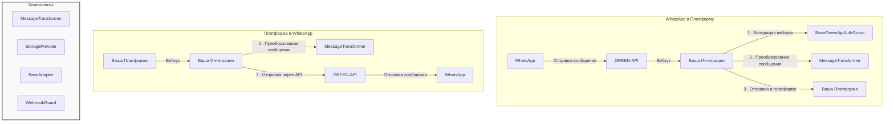

[# Универсальная интеграционная платформа для GREEN-API

## Поддержка

[](mailto:support@greenapi.com)
[](https://t.me/greenapi_support_bot)
[](https://wa.me/77273122366)

## Руководства и новости

[](https://www.youtube.com/@green-api)
[](https://t.me/green_api)
[](https://whatsapp.com/channel/0029VaLj6J4LNSa2B5Jx6s3h)

[](https://www.npmjs.com/package/@green-api/whatsapp-chatbot-js-v2)
[](https://opensource.org/licenses/MIT)

- [Documentation in English](./README.md)

Гибкая интеграционная платформа, разработанная для упрощения процесса подключения WhatsApp шлюза GREEN-API к различным
сторонним сервисам.

## Содержание

- [Установка](#установка)
- [Основные компоненты](#основные-компоненты)
- [Руководство разработчика](#руководство-разработчика)
- [Рабочий пример](#рабочий-пример)
- [Реальные примеры](#реальные-примеры)
- [Лучшие практики](#лучшие-практики)

## Установка

```bash
npm install @green-api/greenapi-integration
```

## Основные компоненты

### 1. BaseAdapter

Основа вашей интеграции. Управляет сообщениями и инстансами, а также логикой взаимодействия с платформой.

```typescript
abstract class BaseAdapter<TPlatformWebhook, TPlatformMessage> {
	public constructor(
		transformer: MessageTransformer<TPlatformWebhook, TPlatformMessage>,
		storage: StorageProvider
	);

	public abstract createPlatformClient(params: any): Promise<any>;

	public abstract sendToPlatform(message: TPlatformMessage, instance: TInstance): Promise<void>;
}
```

#### Методы

При расширении BaseAdapter, ваша реализация получает доступ к следующим методам:

##### Обработка вебхуков

Эти методы обработки вебхуков автоматически вызывают ваши методы преобразования (маппинга) сообщений, без необходимости
использовать их напрямую.

```typescript
// Обработка вебхуков от вашей платформы
await adapter.handlePlatformWebhook(webhookData, instanceId);

// Обработка вебхуков от GREEN-API. Второй параметр указывает функции, какие конкретные вебхуки обрабатывать.
// Второй параметр должен быть указан, иначе вебхуки не будут обработаны.
await adapter.handleGreenApiWebhook(webhook, ['incomingMessageReceived']);
```

##### Управление инстансами

```typescript
// Создание нового инстанса
const instance = await adapter.createInstance(instanceData, settings, userEmail);

// Получение данных инстанса
const details = await adapter.getInstance(instanceId);

// Удаление инстанса
await adapter.removeInstance(instanceId);
```

##### Управление пользователями

```typescript
// Создание нового пользователя
const user = await adapter.createUser(userEmail, userData);

// Обновление пользователя
await adapter.updateUser(userEmail, updateData);
```

#### Пример реализации вебхуков

```typescript
// Конечная точка для вебхуков платформы
app.post('/webhook/platform', async (req, res) => {
	try {
		await adapter.handlePlatformWebhook(req.body, instanceId);
		res.status(200).send();
	} catch (error) {
		console.error('Не удалось обработать вебхук платформы:', error);
		res.status(500).send();
	}
});

// Конечная точка для вебхуков GREEN-API
app.post('/webhook/green-api', async (req, res) => {
	try {
		// Обработка определенных типов вебхуков
		await adapter.handleGreenApiWebhook(req.body, [
			'incomingMessageReceived',
			'outgoingMessageStatus'
		]);
		res.status(200).send();
	} catch (error) {
		console.error('Не удалось обработать вебхук GREEN-API:', error);
		res.status(500).send();
	}
});
```

### 2. MessageTransformer

Преобразовывает форматы сообщений между GREEN-API и вашей платформой.

```typescript
abstract class MessageTransformer<TPlatformWebhook, TPlatformMessage> {
	abstract toPlatformMessage(webhook: GreenApiWebhook): TPlatformMessage;

	abstract toGreenApiMessage(message: TPlatformWebhook): Message;
}
```

### 3. StorageProvider

Интерфейс для операций с хранением данных.

```typescript
abstract class StorageProvider<TUser extends BaseUser = BaseUser, TInstance extends BaseInstance = Instance> {
	abstract createInstance(instance: BaseInstance, userId: bigint | number): Promise<TInstance>;

	abstract getInstance(idInstance: number | bigint): Promise<TInstance | null>;

	abstract removeInstance(instanceId: number | bigint): Promise<TInstance>;

	abstract createUser(data: any): Promise<TUser>;

	abstract findUser(identifier: string): Promise<TUser | null>;

	abstract updateUser(identifier: string, data: any): Promise<TUser>;
}
```

### 4. BaseGreenApiAuthGuard

Аутентифицирует входящие вебхуки от GREEN-API.

```typescript
abstract class BaseGreenApiAuthGuard<T extends BaseRequest = BaseRequest> {
	constructor(protected storage: StorageProvider);

	// Валидация входящих вебхуков
	async validateRequest(request: T): Promise<boolean>;
}
```

Пример использования `BaseGreenApiAuthGuard`:

```typescript
class YourAuthGuard extends BaseGreenApiAuthGuard<YourRequest> {
	constructor(storage: StorageProvider) {
		super(storage);
	}
}

// Использование с Express
app.post('/webhook', async (req, res) => {
	const guard = new YourAuthGuard(storage);
	try {
		await guard.validateRequest(req);
		// Обработка вебхука ...
	} catch (error) {
		if (error instanceof AuthenticationError) {
			res.status(401).json({error: error.message});
			return;
		}
		res.status(500).json({error: 'Internal server error'});
	}
});
```

### 5. GreenApiLogger

Структурированный JSON-логгер с цветным выводом. Обеспечивает единый формат логирования в вашем приложении с корректной
обработкой ошибок и сериализацией.

```typescript
const logger = GreenApiLogger.getInstance("YourComponent");

// Базовое логирование
logger.debug("Debug message", {someContext: "value"});
logger.info("Info message", {userId: 123});
logger.warn("Warning message", {alert: true});
logger.error("Error occurred", {errorCode: 500});
logger.fatal("Fatal error", {critical: true});

// Логирование ошибок с контекстом
try {
	await someOperation();
} catch (error) {
	logger.logErrorResponse(error, "Operation failed", {
		operationId: "123",
		additionalInfo: "some context"
	});
}
```

#### Возможности

- Структурированное JSON-логирование в едином формате
- Цветной вывод в зависимости от уровня лога (debug=голубой, info=зеленый, warn=желтый, error=красный, fatal=пурпурный)
- Встроенная обработка ошибок с форматированием стека вызовов
- Автоматическая сериализация
- Независимость от фреймворка - работает с любым Node.js приложением
- Специальная обработка ошибок Axios с подробной информацией о запросе/ответе

#### Уровни логирования

- `debug` - Подробная информация для отладки
- `info` - Общая информация о работе системы
- `warn` - Предупреждения о потенциально опасных ситуациях
- `error` - Сообщения об ошибках
- `fatal` - Критические ошибки, требующие немедленного внимания
- `log` - Альтернатива info (для совместимости)

#### Формат вывода

```json
{
  "timestamp": "30/01/2025, 04:34:49",
  "level": "error",
  "context": "CoreService",
  "message": "Operation failed",
  "error": "Failed to process request",
  "stack": [
    "Error: Failed to process request",
    "    at CoreService.process (/app/service.js:123:45)",
    "    at async Router.handle (/app/router.js:67:89)"
  ],
  "additionalContext": {
    "requestId": "abc-123",
    "userId": "user_456"
  }
}
```

#### Обработка ошибок

```typescript
// Обработка ошибок Axios
try {
	await apiRequest();
} catch (error) {
	logger.logErrorResponse(error, "API Request failed", {
		endpoint: "/users",
		method: "POST"
	});
}
```

// Получим подробную информацию об ошибке API:

```json
{
  "timestamp": "30/01/2025, 04:34:49",
  "level": "error",
  "context": "ApiService",
  "message": "API Request failed - API Error:",
  "status": 400,
  "statusText": "Bad Request",
  "data": {
    "error": "Invalid input"
  },
  "url": "https://api.example.com/users",
  "method": "POST",
  "endpoint": "/users"
}
```

#### Использование с фреймворками

Логгер независим от фреймворков, но легко интегрируется с любым из них:

```typescript
// Пример с NestJS
const app = await NestFactory.create(AppModule, {
	logger: GreenApiLogger.getInstance("NestJS")
});

// Пример с Express
app.use((err, req, res, next) => {
	const logger = GreenApiLogger.getInstance("Express");
	logger.error("Request failed", {
		path: req.path,
		method: req.method,
		error: err.message
	});
	next(err);
});
```

#### Важное примечание об использовании логгера

Хотя вы можете использовать этот логгер вместе с другими решениями для логирования, рекомендуется отключить встроенный
логер вашего фреймворка во избежание дублирования или некорректного форматирования логов.

Например, при использовании NestJS, вы можете отключить его встроенный логер следующим образом:

```typescript
// main.ts
const app = await NestFactory.create(AppModule, {
	logger: false  // Отключение логера NestJS
});
```

А затем использовать его в вашем классе так:

```typescript
gaLogger = GreenApiLogger.getInstance(YourClass.name);
```

#### Методы

##### Основные методы логирования

- `debug(message: string, context?: Record<string, any>)`: Логирование отладочной информации
- `info(message: string, context?: Record<string, any>)`: Логирование информационных сообщений
- `warn(message: string, context?: Record<string, any>)`: Логирование предупреждений
- `error(message: string, context?: Record<string, any>)`: Логирование ошибок
- `fatal(message: string, context?: Record<string, any>)`: Логирование критических ошибок
- `log(message: string, context?: string)`: Альтернатива методу info

##### Специальные методы

- `logErrorResponse(error: any, context: string, additionalContext?: Record<string, any>)`:
  Расширенное логирование ошибок со специальной обработкой ошибок Axios и стека вызовов

##### Вспомогательные методы

- `getInstance(context: string = "Global"): GreenApiLogger`: Получение или создание экземпляра логгера для указанного
  контекста

#### Лучшие практики

1. **Используйте последовательные имена контекста**

```typescript
// В вашем компоненте/сервисе
private readonly
logger = GreenApiLogger.getInstance(YourService.name);
```

2. **Включайте релевантный контекст**

```typescript
logger.info("User action completed", {
	userId: user.id,
	action: "profile_update",
	duration: timeTaken
});
```

3. **Правильная обработка ошибок**

```typescript
try {
	await complexOperation();
} catch (error) {
	logger.logErrorResponse(error, "Complex operation failed", {
		operationId: id,
		parameters: params
	});
}
```

4. **Используйте соответствующие уровни логирования**

```typescript
// Debug для детальной информации
logger.debug("Processing chunk", {chunkId: 123, size: 1024});

// Info для общей информации о работе
logger.info("User logged in", {userId: 456});

// Warn для потенциальных проблем
logger.warn("High memory usage", {memoryUsage: "85%"});

// Error для реальных проблем
logger.error("Database connection failed", {dbHost: "primary"});

// Fatal для критических проблем
logger.fatal("System shutdown required", {reason: "data corruption"});
```

### 6. GreenApiClient

Прямой интерфейс к методам GREEN-API.

```typescript
const client = new GreenApiClient({
	idInstance: 'your_instance_id',
	apiTokenInstance: 'your_token'
});

// Примеры специальных операций:
await client.setProfilePicture(fileBlob);
await client.getAuthorizationCode(phoneNumber);
await client.getQR();
```

## Руководство для разработчика

Это руководство проведет вас через процесс создания вашей первой интеграции с WhatsApp шлюзом GREEN-API.

### Структура проекта

```
your-integration/
├── src/
│   ├── core/
│   │   ├── adapter.ts         # Адаптер платформы
│   │   ├── transformer.ts     # Преобразователь сообщений
│   │   ├── storage.ts         # Реализация хранилища
│   │   └── router.ts          # Эндпоинты для вебхуков
│   ├── types/
│   │   └── types.ts           # Типы
│   └── main.ts                # Точка запуска приложения
├── package.json
└── tsconfig.json
```



### Этапы реализации

#### Этап 1: Определение типов платформы

Сначала определите типы сообщений для вашей платформы:

```typescript
// types/types.ts
export interface YourPlatformWebhook {
	id: string;
	from: string;
	message: string;
	timestamp: number;
	// Добавьте другие поля, специфичные для вашей платформы
}

export interface YourPlatformMessage {
	recipient: string;
	content: string;
	// Добавьте другие поля, специфичные для вашей платформы
}
```

#### Этап 2. Создание преобразователя сообщений

Создайте преобразователь, который конвертирует сообщения между форматом вашей платформы и форматом GREEN-API:

```typescript
// core/transformer.ts
import { MessageTransformer, Message, GreenApiWebhook } from '@green-api/greenapi-integration';
import { YourPlatformWebhook, YourPlatformMessage } from '../types/types';

export class YourTransformer extends MessageTransformer<YourPlatformWebhook, YourPlatformMessage> {
	toPlatformMessage(webhook: GreenApiWebhook): YourPlatformMessage {
		// Преобразование вебхука GREEN-API в формат вашей платформы
		return {
			recipient: webhook.senderData.sender,
			content: webhook.messageData.textMessageData?.textMessage || '',
		};
	}

	toGreenApiMessage(message: YourPlatformWebhook): Message {
		// Преобразование вебхука вашей платформы в формат GREEN-API
		return {
			type: 'text',
			chatId: message.from,
			message: message.message,
		};
	}
}
```

#### Этап 3: Реализация хранилища

Создайте провайдер хранилища для управления пользователями и инстансами. Вы можете использовать любую базу данных или
ORM:

```typescript
// core/storage.ts
import { StorageProvider, BaseUser, Instance, Settings } from '@green-api/greenapi-integration';
import { PrismaClient } from '@prisma/client'; // Or your database client

export class YourStorage extends StorageProvider {
	private db: PrismaClient;

	constructor() {
		this.db = new PrismaClient();
	}

	async createInstance(instance: Instance, userId: bigint) {
		return this.db.instance.create({
			data: {
				idInstance: instance.idInstance,
				apiTokenInstance: instance.apiTokenInstance,
				userId,
				settings: instance.settings || {},
			},
		});
	}

	// Остальные методы
}
```

#### Этап 4: Создание адаптера платформы

Адаптер обрабатывает фактическое взаимодействие между платформами:

```typescript
// core/adapter.ts
import { BaseAdapter, Instance } from '@green-api/greenapi-integration';
import { YourPlatformClient } from 'your-platform-sdk';
import { YourPlatformWebhook, YourPlatformMessage } from '../types/types';

export class YourAdapter extends BaseAdapter<YourPlatformWebhook, YourPlatformMessage> {
	async createPlatformClient(config: { apiKey: string, apiUrl: string }) {
		return new YourPlatformClient({
			baseUrl: config.apiUrl,
			apiKey: config.apiKey,
		});
	}

	async sendToPlatform(message: YourPlatformMessage, instance: Instance) {
		const client = await this.createPlatformClient(instance.config);
		await client.sendMessage(message);
	}
}
```

#### Этап 5: Реализация контроллера вебхуков

Определите эндпоинты вебхуков, которые будет слушать ваше приложение:

```typescript
// core/webhook.ts
import express from 'express';
import { YourAdapter } from '../core/adapter';
import { YourTransformer } from '../core/transformer';
import { YourStorage } from '../core/storage';

const router = express.Router();
const storage = new YourStorage();
const transformer = new YourTransformer();
const adapter = new YourAdapter(transformer, storage);

class WebhookGuard extends BaseGreenApiAuthGuard {
	constructor(storage: StorageProvider) {
		super(storage);
	}
}

const guard = new WebhookGuard(storage);

// Эндпоинты для вебхуков
router.post('/green-api', async (req, res) => {
	try {
		// Проверка вебхука
		await guard.validateRequest(req);

		// Обработка вебхука после проверки. 
		// В списке вторым параметром укажите типы вебхуков, которые необходимо обработать
		await adapter.handleGreenApiWebhook(req.body, ['incomingMessageReceived']);
		res.status(200).json({status: 'ok'});
	} catch (error) {
		if (error instanceof AuthenticationError) {
			res.status(401).json({error: 'Ошибка аутентификации'});
			return;
		}
		console.error('Ошибка обработки вебхука:', error);
		res.status(500).json({error: 'Внутренняя ошибка сервера'});
	}
});

router.post('/platform', async (req, res) => {
	try {
		const instanceId = req.query.instanceId;
		await adapter.handlePlatformWebhook(req.body, instanceId);
		res.status(200).json({status: 'ok'});
	} catch (error) {
		console.error('Ошибка обработки вебхука платформы:', error);
		res.status(500).json({error: 'Внутренняя ошибка сервера'});
	}
});

router.post('/instance', async (req, res) => {
	try {
		const {idInstance, apiTokenInstance, userEmail} = req.body;

		if (!idInstance || !apiTokenInstance || !userEmail) {
			throw new BadRequestError('Отсутствуют обязательные поля');
		}

		const instance = await adapter.createInstance({
			idInstance: Number(idInstance),
			apiTokenInstance,
			settings: {
				webhookUrl: `${process.env.APP_URL}/webhook/green-api`,
				webhookUrlToken: `token_${Date.now()}`,
				incomingWebhook: 'yes'
			}
		}, userEmail);

		res.status(200).json({
			status: 'ok',
			data: instance,
			message: 'Инстанс успешно создан. Подождите 2 минуты для применения настроек.'
		});

	} catch (error) {
		console.error('Ошибка создания инстанса:', error);
		res.status(500).json({error: 'Не удалось создать инстанс'});
	}
});

export default router;
```

#### Этап 6: Создание точки входа приложения

Соберите все компоненты вместе в точке входа:

```typescript
// main.ts
import express from 'express';
import bodyParser from 'body-parser';
import dotenv from 'dotenv';
import webhookRouter from './controllers/webhook';
import { YourAdapter } from './core/adapter';
import { YourTransformer } from './core/transformer';
import { YourStorage } from './core/storage';

// Загрузка переменных окружения
dotenv.config();

async function bootstrap() {
	// Инициализация компонентов
	const storage = new YourStorage();
	const transformer = new YourTransformer();
	const adapter = new YourAdapter(transformer, storage);

	// Создание Express приложения
	const app = express();
	app.use(bodyParser.json());

	// Настройка маршрутов для вебхуков
	app.use('/webhook', webhookRouter);

	// Запуск сервера
	const port = process.env.PORT || 3000;
	app.listen(port, () => {
		console.log(`Сервер запущен на порту ${port}`);
	});

	console.log('Интеграционная платформа готова!');
}

// Обработка ошибок
bootstrap();
```

Или с NestJS:

```typescript
// main.ts
import { NestFactory } from '@nestjs/core';
import { AppModule } from './app.module';
import helmet from 'helmet';

async function bootstrap() {
	const app = await NestFactory.create(AppModule);
	app.setGlobalPrefix('api');
	app.use(helmet());
	await app.listen(process.env.PORT ?? 3000);
}

bootstrap();
```

### Сборка приложения

1. **Подготовка package.json**

```json
{
  "name": "greenapi-integration-yourplatform",
  "version": "1.0.0",
  "main": "dist/index.js",
  "types": "dist/index.d.ts",
  "scripts": {
    "build": "tsc",
    "prepublishOnly": "npm run build"
  },
  "dependencies": {
    "@green-api/greenapi-integration": "^0.4.0",
    "@prisma/client": "^5.0.0",
    "express": "^4.18.2"
    // другие зависимости
  }
}
```

2. **Сборка**

```bash
npm run build
npm publish
```

## Рабочий пример

В директории `/examples/custom-adapter` вы найдете полный рабочий пример, демонстрирующий:

- Двустороннюю передачу сообщений между WhatsApp и пользовательской платформой
- Обработку вебхуков
- Настройку и конфигурацию инстанса
- Преобразование сообщений
- Обработку ошибок

### Запуск примера

1. Клонируйте репозиторий
2. Обновите .env данными ваших инстансов GREEN-API:

```env
VISITOR_ID_INSTANCE=your_visitor_instance_id
VISITOR_API_TOKEN=your_visitor_instance_token
AGENT_ID_INSTANCE=your_agent_instance_id
AGENT_API_TOKEN=your_agent_instance_token
AGENT_PHONE_NUMBER=your_agent_phone_number
WEBHOOK_URL=your_webhook_url
PORT=3000
```

3. Установите зависимости и запустите:

```bash
cd examples/custom-adapter
npm install
npm start
```

# Полная реализация примера

### Структура проекта

```
examples/
└── custom-adapter/
    ├── src/
    │   ├── main.ts
    │   ├── simple-adapter.ts
    │   ├── simple-transformer.ts
    │   ├── simple-storage.ts
    │   └── types.ts
    ├── .env
    ├── package.json
    └── tsconfig.json
```

### types.ts

```typescript
interface SimplePlatformWebhook {
	messageId: string;
	from: string;
	text: string;
	timestamp: number;
}

interface SimplePlatformMessage {
	to: string;
	content: string;
	replyTo?: string;
}
```

### simple-transformer.ts

```typescript
import {
	MessageTransformer,
	Message,
	GreenApiWebhook,
	formatPhoneNumber,
	IntegrationError
} from '@green-api/greenapi-integration';

export class SimpleTransformer extends MessageTransformer<SimplePlatformWebhook, SimplePlatformMessage> {
	toPlatformMessage(webhook: GreenApiWebhook): SimplePlatformMessage {
		if (webhook.typeWebhook === "incomingMessageReceived") {
			if (webhook.messageData.typeMessage !== "extendedTextMessage") {
				throw new IntegrationError("Поддерживаются только текстовые сообщения", "BAD_REQUEST_ERROR", 400);
			}

			return {
				to: webhook.senderData.sender,
				content: webhook.messageData.extendedTextMessageData?.text || "",
			};
		}
		throw new IntegrationError("Поддерживаются только вебхуки вида incomingMessageReceived", "INTEGRATION_ERROR", 500);
	}

	toGreenApiMessage(message: SimplePlatformWebhook): Message {
		return {
			type: 'text',
			chatId: formatPhoneNumber(message.from),
			message: message.text,
		};
	}
}
```

### simple-storage.ts

```typescript
import { StorageProvider, BaseUser, Instance, Settings } from '@green-api/greenapi-integration';

export class SimpleStorage extends StorageProvider {
	private users: Map<string, BaseUser> = new Map();
	private instances: Map<number, Instance> = new Map();

	async createInstance(instance: Instance, userId: bigint): Promise<Instance> {
		this.instances.set(Number(instance.idInstance), {
			...instance,
		});
		return instance;
	}

	async getInstance(idInstance: number): Promise<Instance | null> {
		return this.instances.get(idInstance) || null;
	}

	async removeInstance(instanceId: number): Promise<Instance> {
		const instance = this.instances.get(instanceId);
		if (!instance) throw new Error('Инстанс не найден');
		this.instances.delete(instanceId);
		return instance;
	}

	async createUser(data: any): Promise<BaseUser> {
		const user = {id: Date.now(), ...data};
		this.users.set(data.email, user);
		return user;
	}

	async findUser(identifier: string): Promise<BaseUser | null> {
		return this.users.get(identifier) || null;
	}

	async updateUser(identifier: string, data: any): Promise<BaseUser> {
		const user = await this.findUser(identifier);
		if (!user) throw new Error('Пользователь не найден');
		const updated = {...user, ...data};
		this.users.set(identifier, updated);
		return updated;
	}
}
```

### simple-adapter.ts

```typescript
import { BaseAdapter, Instance } from "@green-api/greenapi-integration";
import axios from 'axios';

export class SimpleAdapter extends BaseAdapter<SimplePlatformWebhook, SimplePlatformMessage> {
	async createPlatformClient(config: { apiKey: string, apiUrl: string }) {
		return axios.create({
			baseURL: config.apiUrl,
			headers: {
				'Authorization': `Bearer ${config.apiKey}`,
				'Content-Type': 'application/json'
			}
		});
	}

	async sendToPlatform(message: SimplePlatformMessage, instance: Instance): Promise<void> {
		// В реальной реализации мы бы отправляли сообщение на платформу
		// Для демонстрации просто логируем и симулируем ответ
		console.log('Платформа получила сообщение:', message);

		// Симулируем обработку и ответ платформы
		setTimeout(() => {
			console.log('Обработка платформой завершена, отправляем ответ...');
			this.simulatePlatformResponse(message, instance.idInstance);
		}, 1000);
	}

	private async simulatePlatformResponse(originalMessage: SimplePlatformMessage, idInstance: number | bigint) {
		const platformWebhook: SimplePlatformWebhook = {
			messageId: `resp_${Date.now()}`,
			from: originalMessage.to.replace('@c.us', ''),
			text: `Спасибо за ваше сообщение: "${originalMessage.content}". Это автоматический ответ.`,
			timestamp: Date.now()
		};

		await this.handlePlatformWebhook(platformWebhook, idInstance);
	}
}
```

### main.ts

```typescript
import express from "express";
import bodyParser from "body-parser";
import { formatPhoneNumber, GreenApiClient } from "@green-api/greenapi-integration";
import { SimpleTransformer } from "./simple-transformer";
import { SimpleStorage } from "./simple-storage";
import { SimpleAdapter } from "./simple-adapter";
import * as dotenv from "dotenv";

dotenv.config();

async function main() {
	// Инициализация компонентов
	const transformer = new SimpleTransformer();
	const storage = new SimpleStorage();
	const adapter = new SimpleAdapter(transformer, storage);

	// Конфигурация обоих инстансов
	const visitorInstance = {
		idInstance: Number(process.env.VISITOR_ID_INSTANCE),
		apiTokenInstance: process.env.VISITOR_API_TOKEN!,
	};

	const agentInstance = {
		idInstance: Number(process.env.AGENT_ID_INSTANCE),
		apiTokenInstance: process.env.AGENT_API_TOKEN!,
	};

	// Создание клиента GREEN-API для посетителя (для отправки начального сообщения)
	const visitorClient = new GreenApiClient(visitorInstance);

	// Настройка инстанса агента
	console.log("Настройка инстанса агента...");
	const user = await adapter.createUser("agent@example.com", {
		email: "agent@example.com",
		name: "Agent",
	});

	const instance = await adapter.createInstance({
		idInstance: agentInstance.idInstance, apiTokenInstance: agentInstance.apiTokenInstance, settings: {
			webhookUrl: process.env.WEBHOOK_URL + "/webhook/green-api",
			webhookUrlToken: "your-secure-token",
			incomingWebhook: "yes",
		},
	}, user.email);

	console.log("Ожидание 2 минуты для применения настроек...");
	await new Promise(resolve => setTimeout(resolve, 120000));
	console.log("Инстанс готов!");

	// Настройка веб-сервера
	const app = express();
	app.use(bodyParser.json());

	// Обработка вебхуков от GREEN-API
	app.post("/webhook/green-api", async (req, res) => {
		try {
			console.log("Получен вебхук от GREEN-API:", req.body);
			await adapter.handleGreenApiWebhook(req.body, ["incomingMessageReceived"]);
			res.status(200).json({status: "ok"});
		} catch (error) {
			console.error("Ошибка обработки вебхука:", error);
			res.status(500).json({error: "Внутренняя ошибка сервера"});
		}
	});

	// Запуск сервера
	const port = Number(process.env.PORT) || 3000;
	app.listen(port, () => {
		console.log(`Сервер вебхуков запущен на порту ${port}`);
	});

	// Отправка начального сообщения от посетителя
	console.log("Отправка начального сообщения от посетителя...");
	await visitorClient.sendMessage({
		chatId: formatPhoneNumber(process.env.AGENT_PHONE_NUMBER!),
		message: "Здравствуйте! Это тестовое сообщение от посетителя.",
		type: "text",
	});

	console.log("Начальное сообщение отправлено! Проверьте WhatsApp агента для просмотра ответа.");
}

main().catch(console.error);
```

### .env

```env
VISITOR_ID_INSTANCE=your_visitor_instance_id
VISITOR_API_TOKEN=your_visitor_instance_token
AGENT_ID_INSTANCE=your_agent_instance_id
AGENT_API_TOKEN=your_agent_instance_token
AGENT_PHONE_NUMBER=your_agent_phone_number
WEBHOOK_URL=your_webhook_url
PORT=3000
```

## Реальные примеры

Для полных примеров реальных интеграций, смотрите:

- [Интеграция с Rocket.Chat](https://github.com/green-api/greenapi-integration-rocketchat)

## Утилиты

Платформа предоставляет несколько вспомогательных функций:

```typescript
// Форматирование телефонных номеров для GREEN-API
formatPhoneNumber('+1234567890') // Возвращает '1234567890@c.us'

// Генерация безопасных случайных токенов
generateRandomToken(32) // Возвращает 32-символьный случайный токен

// Извлечение номера телефона из vcard
const vcard = 'BEGIN:VCARD\nTEL:+1234567890\nEND:VCARD'
extractPhoneNumberFromVCard(vcard) // Возвращает '+1234567890'

// Проверка значений настроек
isValidSettingValue('webhookUrl', 'https://example.com') // Возвращает true

// Очистка настроек
const input = {
	webhookUrl: 'https://example.com',
	outgoingWebhook: 'yes',
	invalidKey: 'value',
	delaySendMessagesMilliseconds: 'invalid'
}
validateAndCleanSettings(input) // Возвращает { webhookUrl: 'https://example.com', outgoingWebhook: 'yes' }
```

## Лицензия

MIT
]()
